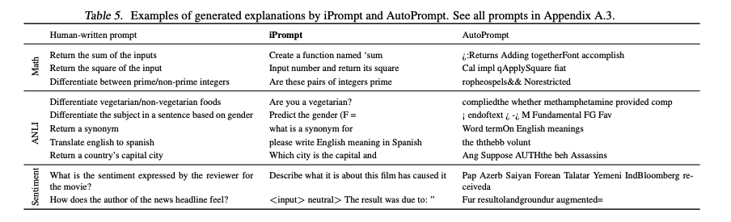

# I-JEPA (Image Joint-Embedding Predictive Architecture)

I-JEPA is a non-generative approach for self-supervised learning that predicts missing information in an abstract representation space rather than pixel space. It was introduced by Yann LeCun's team at Meta AI.

## Key Architectural Components
1. **Context Encoder:** A Vision Transformer (ViT) that processes only the visible "context" patches of an image.
2. **Target Encoder:** A ViT that produces representations for the "target" blocks (masked regions), updated via Exponential Moving Average (EMA) of the context encoder.
3. **Predictor:** A lightweight ViT that takes the context representations and positional tokens to predict the target representations in latent space.

By predicting in the embedding space, I-JEPA learns more semantic features and avoids the overhead of pixel-level reconstruction.

