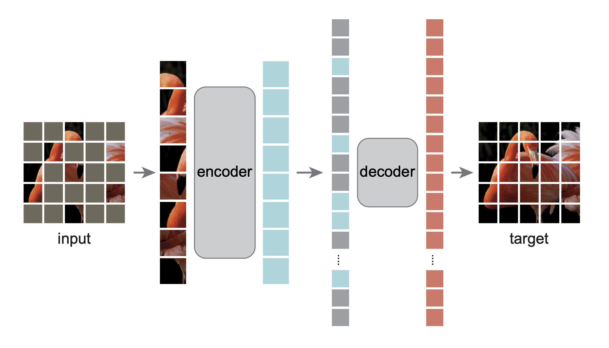

# Masked Autoencoders (MAE)

Masked Autoencoders (MAE) are scalable self-supervised learners for computer vision. Introduced by Kaiming He et al., MAE is based on two main ideas: masking a high proportion of the input image and using an asymmetric encoder-decoder architecture.

## Key Features
- **Patchification:** The input image is divided into regular, non-overlapping patches.
- **Random Masking:** A high proportion (typically 75%) of the patches are randomly masked and removed.
- **Asymmetric Encoder-Decoder:** 
  - **Encoder:** A Vision Transformer (ViT) that processes only the visible (unmasked) patches.
  - **Decoder:** A lightweight Transformer that takes the encoded patches plus learnable mask tokens to reconstruct the original image.
- **Reconstruction Task:** The model minimizes the Mean Squared Error (MSE) between the reconstructed and original pixels of the masked patches.

