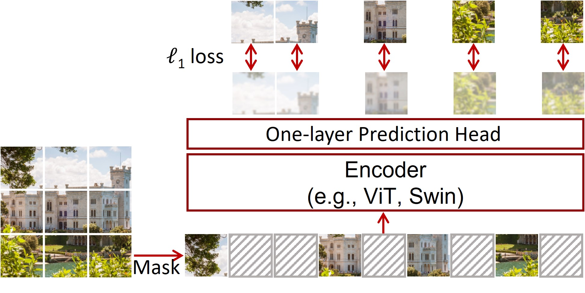

# Masked Image Modeling (MIM)

Masked Image Modeling (MIM) is a general self-supervised pre-training task where a model is trained to reconstruct missing or corrupted parts of an image. This paradigm is inspired by Masked Language Modeling (MLM) in NLP (e.g., BERT).

## General Pipeline
1. **Patch Partitioning:** Dividing the input image into non-overlapping patches.
2. **Masking Strategy:** Randomly selecting a portion (e.g., 40% to 75%) of patches to be hidden or replaced with mask tokens.
3. **Encoder:** Processing the corrupted image to extract latent representations.
4. **Prediction Head/Decoder:** Reconstructing the original signal (pixels, HOG features, or visual tokens) for the masked regions.

MIM has become a cornerstone of modern vision models, enabling efficient pre-training on large-scale unlabeled datasets.

