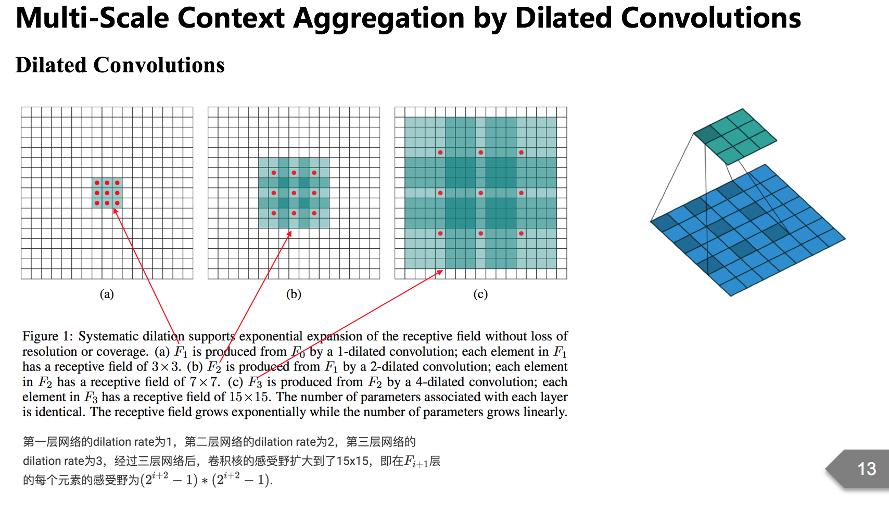

# MoCo (Momentum Contrast)

MoCo (Momentum Contrast) is a contrastive learning method that treats self-supervised learning as a dictionary look-up task. It was introduced by Kaiming He et al. at Meta AI.

## Key Components
- **Query Encoder:** Encodes the query image into a representation, updated via standard backpropagation.
- **Momentum Encoder:** Encodes key images. Its parameters are updated as a momentum-based moving average of the query encoder, ensuring consistency.
- **Dynamic Dictionary (Queue):** A large queue that stores encoded keys from previous mini-batches, decoupling dictionary size from batch size.
- **Contrastive Loss:** Uses InfoNCE loss to match queries with positive keys while pushing them away from negatives in the queue.

MoCo pioneered the use of a momentum encoder and a queue to scale contrastive learning to large numbers of negative samples.

