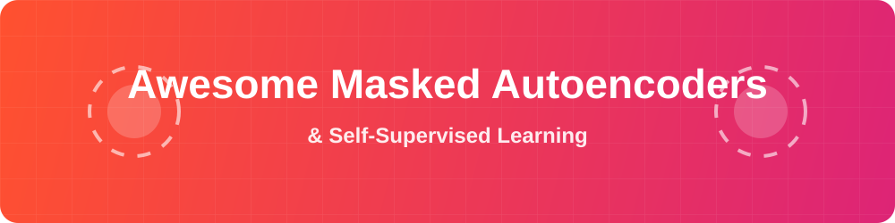

  

  
  
  
  
  

# 🌟 Awesome Masked Autoencoders (MAE) & Self-Supervised Learning

Welcome to the ultimate curated list of **Masked Autoencoders (MAE)**, **Masked Image Modeling (MIM)**, and **Self-Supervised Learning (SSL)** architectures. Whether you are researching **Vision Transformers (ViT)**, deep generative models, or contrastive learning paradigms in **Computer Vision**, this repository provides detailed guides, architecture diagrams, and paper links to accelerate your deep learning journey.

---

  

## 🚀 Alternatives to Masked Autoencoders (MAEs)

When moving beyond standard Masked Autoencoders and Masked Image Modeling (MIM) for self-supervised representation learning, several powerful alternatives exist. These state-of-the-art methods bypass simple pixel-level reconstruction, focusing instead on contrasting views, spatial context, or complex distributional properties.

## 📊 Detailed Alternatives and Architectures

Below is a comprehensive table detailing Masked Autoencoders and all **17** of their various self-supervised and generative alternatives:

| 🧠 Model / Paradigm | 📅 Year | 📄 Original Paper | 📝 Description |
| :--- | :---: | :--- | :--- |
| **[Masked Autoencoders (MAE)](./MAE.md)** | 2021 | [He et al.](https://arxiv.org/abs/2111.06377) | Scalable vision learners using asymmetric encoder-decoders. |
| **[Masked Image Modeling (MIM)](./MIM.md)** | 2016 | [Pathak et al.](https://arxiv.org/abs/1604.07379) | The general paradigm of reconstructing missing image patches (e.g., Context Encoders). |
| **[SimCLR](./SimCLR.md)** | 2020 | [Chen et al.](https://arxiv.org/abs/2002.05709) | A simple framework for contrastive learning of visual representations. |
| **[MoCo](./MoCo.md)** | 2019 | [He et al.](https://arxiv.org/abs/1911.05722) | Momentum Contrast: builds dynamic dictionaries with a queue and momentum encoder. |
| **[I-JEPA](./I-JEPA.md)** | 2023 | [Assran et al.](https://arxiv.org/abs/2301.08243) | Joint-Embedding Predictive Architecture predicting in a latent abstract space. |
| **[VICReg](./VICReg.md)** | 2021 | [Bardes et al.](https://arxiv.org/abs/2105.04906) | Non-contrastive regularization preventing collapse via variance, invariance, and covariance. |
| **[BEiT](./BEiT.md)** | 2021 | [Bao et al.](https://arxiv.org/abs/2106.08254) | BERT-style pre-training using discrete visual tokens. |
| **[DINO](./DINO.md)** | 2021 | [Caron et al.](https://arxiv.org/abs/2104.14294) | Self-distillation with no labels, learning object-centric features. |
| **[SwAV](./SwAV.md)** | 2020 | [Caron et al.](https://arxiv.org/abs/2006.09882) | Swapping Assignments between Views, contrasting online cluster assignments. |
| **[SimMIM](./SimMIM.md)** | 2021 | [Xie et al.](https://arxiv.org/abs/2111.09886) | A simplified framework for masked image modeling with direct pixel reconstruction. |
| **[Data2Vec](./Data2Vec.md)** | 2022 | [Baevski et al.](https://arxiv.org/abs/2202.03555) | A unified teacher-student framework across vision, speech, and text. |
| **[MaskFeat](./MaskFeat.md)** | 2021 | [Wei et al.](https://arxiv.org/abs/2112.09133) | Masked feature prediction using Histograms of Oriented Gradients (HOG) as targets. |
| **[CAE](./CAE.md)** | 2022 | [Chen et al.](https://arxiv.org/abs/2202.03026) | Context Autoencoder using a latent regressor for masked patch prediction. |
| **[RotNet](./RotNet.md)** | 2018 | [Gidaris et al.](https://arxiv.org/abs/1803.07728) | Unsupervised representation learning by predicting 2D image rotations. |
| **[Jigsaw Puzzles](./Jigsaw.md)** | 2016 | [Noroozi & Favaro](https://arxiv.org/abs/1603.09246) | Unsupervised learning of spatial context by solving jigsaw puzzles of image patches. |
| **[Variational Autoencoder (VAE)](./VAE.md)** | 2013 | [Kingma & Welling](https://arxiv.org/abs/1312.6114) | Generative models mapping inputs to probabilistic latent spaces with reparameterization. |
| **[Sparse Autoencoder (SAE)](./SparseAutoencoder.md)** | 2007 | [Ranzato et al.](https://proceedings.neurips.cc/paper/2007/file/9c838d2e45b2ad1094d42f4ef36764f6-Paper.pdf) | Autoencoders with sparsity constraints to learn efficient, localized, and salient features. |

***

## 1️⃣ Contrastive Learning
Contrastive Learning methods learn by pulling "positive" pairs (different augmented views of the same image) closer in the embedding space, while pushing apart "negative" pairs (different images). 
* **[SimCLR](./SimCLR.md):** Uses a simple framework that avoids memory banks, relying instead on large batch sizes and data augmentation.
* **[MoCo](./MoCo.md) (Momentum Contrast):** Builds dynamic dictionaries with a queue and a momentum encoder, decoupling batch size from the number of negative samples.

## 2️⃣ Joint-Embedding Predictive Architectures (JEPAs)
Instead of matching pixel-by-pixel, JEPAs predict the representation of a masked patch in an abstract latent space rather than the input space itself. 
* **[I-JEPA](./I-JEPA.md) (Image-Joint Embedding Predictive Architecture):** Predicts the semantic embedding of a hidden/masked patch from a visible context block, resulting in strong object-level understanding without pixel-level detail reconstruction.
* **[VICReg](./VICReg.md) (Variance-Invariance-Covariance Regularization):** A non-contrastive method that prevents representation collapse by maximizing variance, ensuring feature invariance, and minimizing covariance between embedding dimensions.

## 3️⃣ Self-Distillation / Clustering Methods
These techniques align the feature representations of different views of the same image without requiring negative samples.
* **[DINO](./DINO.md) (Self-Distillation with No Labels):** Treats self-supervised learning as a teacher-student distillation process. The student network predicts the output of the teacher network, employing a centered and sharpened softmax to prevent collapse.
* **[SwAV](./SwAV.md) (Swapping Assignments between multiple Views):** Computes cluster assignments for multiple views of an image and swaps them, forcing the model to learn view-invariant features.

## 4️⃣ Canonical / Spatial Context Prediction
These spatial approaches learn by understanding geometry or absolute positioning rather than reconstructing missing parts.
* **[RotNet](./RotNet.md):** Trains models by predicting the rotational orientation of an image (0°, 90°, 180°, or 270°).
* **[Jigsaw Puzzles](./Jigsaw.md):** Divides images into a grid, shuffles the patches, and tasks the model with rearranging them into the correct spatial order. 

## 5️⃣ Deep Generative Alternatives
While not technically "masked" autoencoders, they utilize the broader Autoencoder framework for representation learning.
* **[Variational Autoencoders (VAEs)](./VAE.md):** Probabilistic models that map inputs to a latent space governed by probability distributions, allowing for both representation learning and generative decoding.
* **[Sparse Autoencoders (SAEs)](./SparseAutoencoder.md):** Enforce a sparsity penalty on the hidden layers, forcing the model to learn highly specific, localized, and meaningful features.

***

## 🔍 Further Exploration
To evaluate how these alternative frameworks perform relative to masked modeling approaches, consider reviewing:
* **Benchmark Comparisons:** Explore how contrastive methods compare against MIM on ImageNet classification via the [CVPR Open Access Repository](https://thecvf.com).
* **Hybrid Approaches:** Read about frameworks that attempt to distill masked autoencoders into contrastive models in research on [MOMA](https://springer.com).
* **Theoretical Foundations:** Understand the mathematical properties of invariant feature learning via the [CVPR 2023 Paper Archive](https://thecvf.com/content/CVPR2023/papers/Kong_Understanding_Masked_Image_Modeling_via_Learning_Occlusion_Invariant_Feature_CVPR_2023_paper.pdf).

## 📈 Star History

   <a href="https://www.star-history.com/?repos=ishandutta2007%2FAwesome-Masked-Autoencoders&type=date&legend=bottom-right">
    <picture>
      <source media="(prefers-color-scheme: dark)" srcset="https://api.star-history.com/chart?repos=ishandutta2007/Awesome-Masked-Autoencoders&type=date&theme=dark&legend=bottom-right" />
      <source media="(prefers-color-scheme: light)" srcset="https://api.star-history.com/chart?repos=ishandutta2007/Awesome-Masked-Autoencoders&type=date&legend=bottom-right" />
      
    </picture>
   </a>

 

<strong>SEO Keywords & Tags</strong>

<code>Masked Autoencoders</code>, <code>MAE</code>, <code>Self-Supervised Learning</code>, <code>SSL</code>, <code>Computer Vision</code>, <code>Deep Learning</code>, <code>Vision Transformers</code>, <code>ViT</code>, <code>Contrastive Learning</code>, <code>Generative AI</code>, <code>Image Modeling</code>, <code>Machine Learning</code>, <code>PyTorch</code>, <code>SimCLR</code>, <code>DINO</code>.

