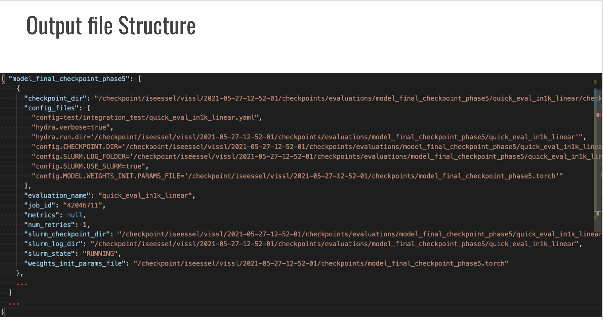

# RotNet

RotNet is a simple yet powerful spatial pretext task for self-supervised learning. The model is trained to recognize the rotation applied to an image.

## How it Works
1. **Input Transformation:** An input image is rotated by one of four discrete angles: 0°, 90°, 180°, or 270°.
2. **Backbone:** A standard ConvNet (e.g., ResNet) processes the rotated images.
3. **Rotation Classifier:** The model predicts which rotation was applied to the image.
4. **Learning Objective:** By learning to identify the "correct" orientation, the model learns about the semantic structure and layout of objects.

RotNet demonstrated that simple geometric tasks can lead to surprisingly good feature representations.

