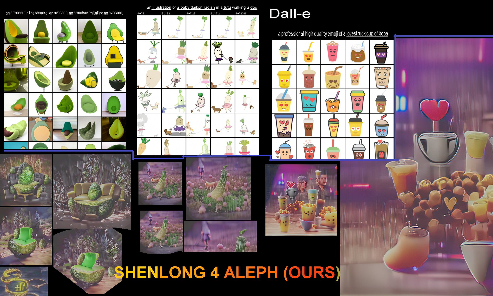

# Variational Autoencoder (VAE)

Variational Autoencoders (VAEs) are generative models that learn a latent representation of data by mapping input to a probability distribution rather than a fixed point.

## Key Concepts
- **Probabilistic Encoder:** Instead of outputting a single latent vector, the encoder outputs the parameters of a distribution (typically mean $\mu$ and variance $\sigma$).
- **Reparameterization Trick:** To allow backpropagation through random sampling, $z$ is computed as $z = \mu + \sigma \odot \epsilon$, where $\epsilon \sim \mathcal{N}(0, I)$.
- **KL Divergence:** A regularization term added to the loss function that forces the latent distribution to be close to a standard normal distribution.
- **Generative Decoder:** The decoder learns to reconstruct the input from sampled latent vectors, allowing it to generate new, similar data by sampling from the latent space.

VAEs are widely used for image generation, denoising, and learning smooth, interpretable latent manifolds.

