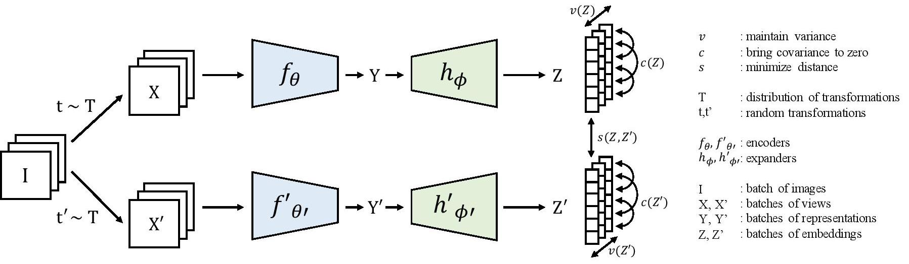

# VICReg (Variance-Invariance-Covariance Regularization)

VICReg is a non-contrastive self-supervised learning method that prevents representation collapse using three regularization terms.

## Core Principles
1. **Invariance:** Minimizes the distance between embeddings of two differently augmented views of the same image.
2. **Variance:** Forces the standard deviation of each embedding dimension to stay above a threshold, preventing all images from mapping to the same point.
3. **Covariance:** Minimizes the correlation between different embedding dimensions, ensuring features carry unique information.

VICReg does not require negative samples or a momentum encoder, making it a simple yet effective alternative to contrastive methods.

